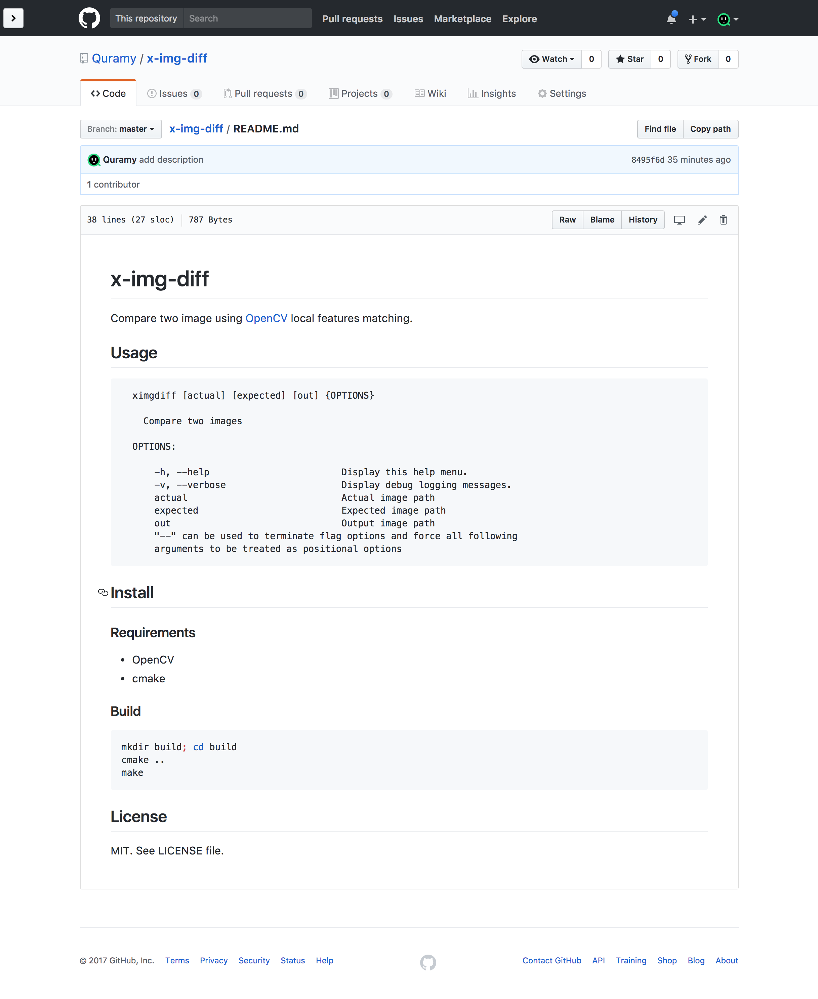
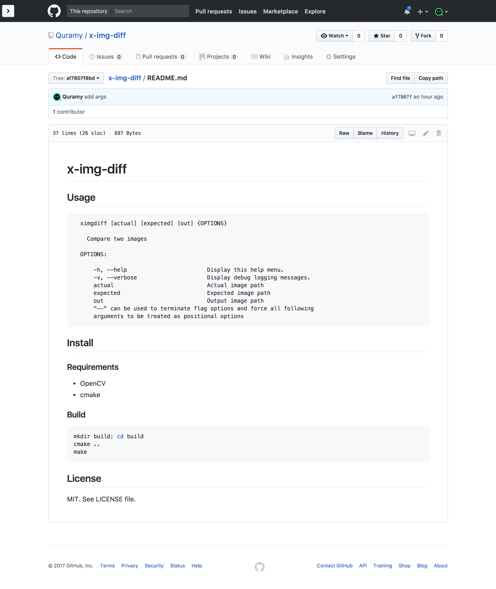

# x-img-diff
Detect structural difference information of 2 images considering into translation.

```sh
ximgdiff example/img/after.png example/img/before.png out.png
```

| after.png | before.png |
| :--: | :--: |
|  |  |

| out.png |
| :--: |
|  |

Each rectangle stands for:

- Cyan: Matching region's bounding box.
- Red: Different parts in the Matching region.
- Purple: Key points region not included any matching regions.

## Usage

```text
  ximgdiff [actual] [expected] [out] {OPTIONS}

    Compare two images

  OPTIONS:

      -h, --help                        Display this help menu.
      -v, --verbose                     Display debug logging messages.
      actual                            Actual image path
      expected                          Expected image path
      out                               Output image path
      "--" can be used to terminate flag options and force all following
      arguments to be treated as positional options
```

## Install
### Requirements

- OpenCV
- cmake

### Build

```sh
mkdir build; cd build
cmake ..
make install
```

## License
MIT. See LICENSE file.
